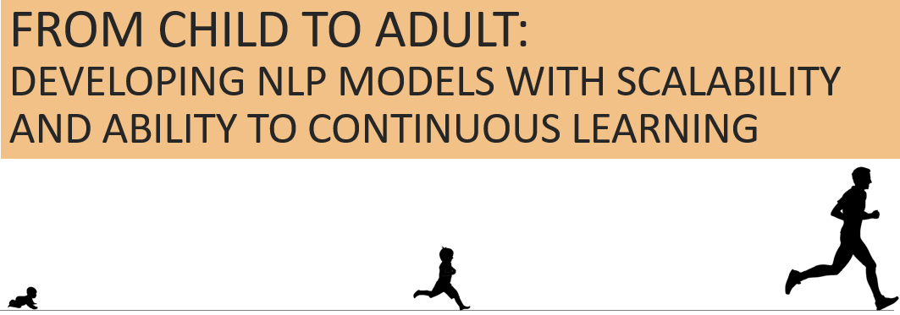

# CE7455-FinalProject



FROM CHILD TO ADULT: DEVELOPING NLP MODELS WITH SCALABILITY AND ABILITY TO CONTINUOUS LEARNING

## Contribution of each member

While all teammates made essential contributions towards the dataset processing, model development, and report analysis, here is a summary of each student's main contribution.

```Ann``` contributed most significantly to the background research, consolidation of ideas and report writing.

```Li Yang``` contributed most significantly to the analysis of the datasets, visualisation of experimentation results, and recording of the final presentation.

```Shifeng``` contributed most significantly in the model development of the word and hybrid models, and running of experimentation iterations.

## Main Idea

In natural language processing, we want our model to have these ideal features:
1. Scalable
2. Continuously learning
3. Apply knowledge to a related but different domain


For more details about corpus data, please go to [data](./data).

For more detials about model, please go to [models](./models).

## Key concept

concept            | remarks
-------------------|-----------------------------------------------------------------
fragment           | We can split an individual word into characters or subwords. Both character and subword are called fragment of a word.
fragment aggregate | A word may have multiple fragments, which mean vary-length embeddings. Before feeding into the model, we need to compress them into fixed-length embedding (usually 25).

And here are some related arguments:
argument                     | remarks
-----------------------------|-----------------------------------------------------------------
word_split_mode_list         | None or Char or Subword.200, Subword.1000. "None" means no word splitting, and no character/subword embedding. "Char" means to split word into characters. "Subword.1000" means to split word into subwords, and the subword vocabulary capacity is 1000.
fragment_aggregate_mode_list | CNN or LSTM. If word_split_mode is "None", then this argument is no use.

## How to run

The entry file is ```main.py```.

In the `main.py` file, it will iterate each word_split_mode in `word_split_mode_list`, and each fragment_aggregate_mode in `fragment_aggregate_mode_list`. In other words, it is a for-loop nested in another for-loop. For example, if word_split_mode_list is "None Char subword.1000", and fragment_aggregate_mode_list is "CNN LSTM", then it will train 5 times (5 runnings):
  * only train on words;
  * split word into characters, and aggregate characters with CNN;
  * split word into characters, and aggregate characters with LSTM;
  * split word into subwords whose vocabulary size 1000, and aggregate subwords with CNN;
  * split word into subwords whose vocabulary size 1000, and aggregate subwords with SLTM;

For each running, it will generate separate log file to save the outputs. And the log file names may look like this:
log file name                        | remarks
------------------------------------ | ----------------------------------------------
output_wsm_None_fam_NoUse.log        | word-split-mode is None, fragment-aggregate-mode is NoUse 
output_wsm_Char_fam_CNN.log          | word-split-mode is Char, fragment-aggregate-mode is CNN
output_wsm_Char_fam_LSTM.log         | word-split-mode is Char, fragment-aggregate-mode is LSTM
output_wsm_Subword.1000_fam_CNN.log  | word-split-mode is Subword with vocabulary size 1000, fragment-aggregate-mode is CNN
output_wsm_Subword.1000_fam_LSTM.log | word-split-mode is Subword with vocabulary size 1000, fragment-aggregate-mode is LSTM

Here is sample command to run.
```bash
python -u main.py --data_dir ./data/sample_500k --gpu_ids 1 \
	--word_split_mode_list None Char Subword.1000 \
	--fragment_aggregate_mode_list CNN LSTM \
	--epochs 20 \
	--train_file_list cbt_train.txt \
	--valid_file_list cbt_valid.txt \
	--test_file_list adolescent_valid.txt adult_test.txt \
	--model LSTM \
	--emsize 200 \
	--nhid 200 \
	--nlayers 2 \
	--batch_size 20 \
	--lr 20 \
	--bptt 35

```

## Sample Output

Sample output:  corpus initialization
```
[2022-04-13 12:11:36.959] corpus.train_file_list: 1
[2022-04-13 12:11:36.959]         ../data/sample_500k/cbt_train.txt
[2022-04-13 12:11:36.959] corpus.valid_file_list: 1
[2022-04-13 12:11:36.959]         ../data/sample_500k/cbt_valid.txt
[2022-04-13 12:11:36.959] corpus.test_file_list: 2
[2022-04-13 12:11:36.959]         ../data/sample_500k/adolescent_valid.txt
[2022-04-13 12:11:36.959]         ../data/sample_500k/adult_test.txt
[2022-04-13 12:11:36.959] corpus.subword_vocab_size: 0
[2022-04-13 12:11:36.959] corpus.subword_model = None. Corpus will not use subword.
[2022-04-13 12:11:36.959] corpus tokenize...
[2022-04-13 12:11:37.655]         train tokens: 511735  ../data/sample_500k/cbt_train.txt
[2022-04-13 12:11:37.800]         valid tokens: 115417  ../data/sample_500k/cbt_valid.txt
. . . . .
```

Sample output: model initialization
```
[2022-04-13 12:11:41.088] RNNModel.rnn_type: LSTM
[2022-04-13 12:11:41.088] RNNModel.ntoken  : 73236
[2022-04-13 12:11:41.089] RNNModel.ninp    : 200
[2022-04-13 12:11:41.089] RNNModel.nhid    : 200
[2022-04-13 12:11:41.089] RNNModel.nlayers : 2
[2022-04-13 12:11:41.089] RNNModel.dropout : 0.2
[2022-04-13 12:11:41.089] RNNModel.tie_weights: False
[2022-04-13 12:11:41.089] RNNModel.fragment_aggregate_mode: CNN
[2022-04-13 12:11:41.089] RNNModel.fragment_cnt           : 202
[2022-04-13 12:11:41.089] RNNModel.fragment_emsize        : 25
[2022-04-13 12:11:41.089] RNNModel.fragment_nhid          : 200
[2022-04-13 12:11:41.089] RNNModel.fragment_embeds     : created
[2022-04-13 12:11:41.090] RNNModel.fragment_cnn3       : created
. . . . .
```

Sample output: first epoch
```
[2022-04-13 12:11:41.276] Epoch 001/20 ==================================================
[2022-04-13 12:11:56.466] E001 |   200/731 batches | lr 20.0000 | loss  7.408 | ppl   1649.42 frag_cnt/word_cnt=2.164=302933/140000
[2022-04-13 12:12:11.715] E001 |   400/731 batches | lr 20.0000 | loss  5.989 | ppl    398.82 frag_cnt/word_cnt=2.172=304046/140000
[2022-04-13 12:12:26.730] E001 |   600/731 batches | lr 20.0000 | loss  5.351 | ppl    210.91 frag_cnt/word_cnt=2.148=300690/140000
[2022-04-13 12:12:36.594] E001 |   731/731 batches | lr 20.0000 | loss  5.187 | ppl    179.02 frag_cnt/word_cnt=2.150=197171/91700
[2022-04-13 12:12:41.936] End E001 | valid loss  5.359; ppl    212.44 | accu 0.1528 = 17633/115380 | w_len 2.1181 = 244384/115380
[2022-04-13 12:12:47.236] End E001 |  test loss  8.902; ppl   7344.12 | accu 0.0282 = 3161/112220 | w_len 2.7297 = 306328/112220 ../data/sample_500k/adolescent_valid.txt
[2022-04-13 12:13:11.196] End E001 |  test loss  9.040; ppl   8435.13 | accu 0.0283 = 14328/506840 | w_len 3.0106 = 1525890/506840 ../data/sample_500k/adult_test.txt
[2022-04-13 12:13:11.196] Save: model.pt... 
[2022-04-13 12:13:11.646] Save: model.pt...Done. best_val_loss: 5.3586
. . . . .
```

Sample output: end of the running
```
[2022-04-13 12:40:33.537] Epoch 020/20 ==================================================
[2022-04-13 12:40:49.275] E020 |   200/731 batches | lr 0.6250 | loss  3.455 | ppl     31.64 frag_cnt/word_cnt=2.164=302933/140000
[2022-04-13 12:41:04.475] E020 |   400/731 batches | lr 0.6250 | loss  3.456 | ppl     31.69 frag_cnt/word_cnt=2.172=304046/140000
[2022-04-13 12:41:19.730] E020 |   600/731 batches | lr 0.6250 | loss  3.351 | ppl     28.54 frag_cnt/word_cnt=2.148=300690/140000
[2022-04-13 12:41:29.613] E020 |   731/731 batches | lr 0.6250 | loss  3.308 | ppl     27.32 frag_cnt/word_cnt=2.150=197171/91700
[2022-04-13 12:41:34.878] End E020 | valid loss  4.589; ppl     98.44 | accu 0.2493 = 28764/115380 | w_len 2.1181 = 244384/115380
[2022-04-13 12:41:40.079] End E020 |  test loss  9.652; ppl  15557.68 | accu 0.0634 = 7117/112220 | w_len 2.7297 = 306328/112220 ../data/sample_500k/adolescent_valid.txt
[2022-04-13 12:42:03.727] End E020 |  test loss 10.083; ppl  23942.22 | accu 0.0627 = 31780/506840 | w_len 3.0106 = 1525890/506840 ../data/sample_500k/adult_test.txt
[2022-04-13 12:42:09.039] End. test loss  9.65; ppl 15566.12 | accu 0.0628 = 7043/112220 | w_len 2.7297 = 306328/112220 ../data/sample_500k/adolescent_valid.txt
[2022-04-13 12:42:32.847] End. test loss 10.06; ppl 23350.17 | accu 0.0626 = 31719/506840 | w_len 3.0106 = 1525890/506840 ../data/sample_500k/adult_test.txt
[2022-04-13 12:42:32.847] =========================================================================================
[2022-04-13 12:42:32.847] valid_loss
[2022-04-13 12:42:32.847]  5.36, 5.04, 4.88, 4.79, 4.76, 4.73, 4.70, 4.68, 4.68, 4.69, 4.60, 4.61, 4.61, 4.60, 4.60, 4.59, 4.60, 4.59, 4.59, 4.59
[2022-04-13 12:42:32.847] valid_loss ppl
[2022-04-13 12:42:32.848]   212.44,  153.89,  132.28,  119.94,  116.37,  113.10,  109.90,  108.14,  107.97,  108.63,   99.93,  100.61,  100.34,   99.07,   99.13,   98.76,   99.03,   98.57,   98.42,   98.44
[2022-04-13 12:42:32.848] test_loss of ../data/sample_500k/adolescent_valid.txt
[2022-04-13 12:42:32.848]  8.90, 8.77, 8.75, 8.98, 8.84, 8.71, 8.93, 9.02, 9.07, 9.27, 9.36, 9.48, 9.61, 9.58, 9.62, 9.63, 9.67, 9.65, 9.65, 9.65
[2022-04-13 12:42:32.848] test_loss of ../data/sample_500k/adolescent_valid.txt ppl
[2022-04-13 12:42:32.856]  7344.12, 6427.16, 6311.87, 7955.31, 6881.28, 6078.37, 7518.89, 8231.56, 8697.40,10591.81,11635.42,13036.16,14841.40,14402.20,15085.10,15251.15,15877.81,15448.97,15566.12,15557.68
[2022-04-13 12:42:32.856] test_loss of ../data/sample_500k/adult_test.txt
[2022-04-13 12:42:32.856]  9.04, 9.04, 9.06, 9.30, 9.04, 9.19, 9.32, 9.38, 9.64, 9.97,10.07,10.22,10.12, 9.98,10.09,10.06,10.08,10.05,10.06,10.08
[2022-04-13 12:42:32.856] test_loss of ../data/sample_500k/adult_test.txt ppl
[2022-04-13 12:42:32.856]  8435.13, 8455.80, 8631.42,10958.35, 8393.73, 9837.60,11160.73,11888.98,15375.15,21398.76,23620.69,27532.43,24957.40,21677.93,24030.01,23476.11,23760.96,23042.40,23350.17,23942.22
```
