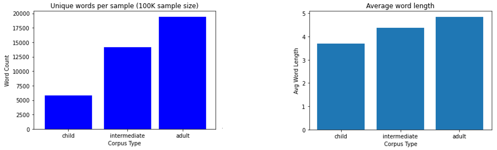
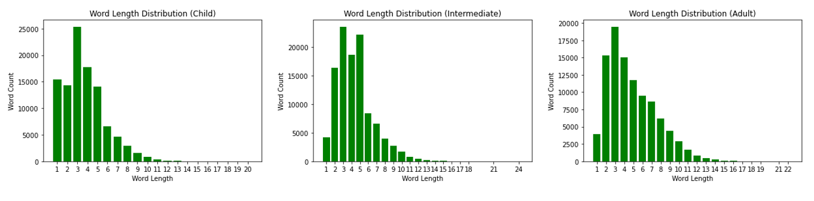

# CE7455-FinalProject-Corpus

The corpus data consists of some reading materials in different level: from child to adolescent (intermediate), and to adult.
For different levels, the vocabulary size (unique word count) and average word length are different.

Here are some statistic charts for the corpus in the subfolder [sample_500k](./sample_500k).

vocabulary size and average word length comparison:

Word length distribution:

