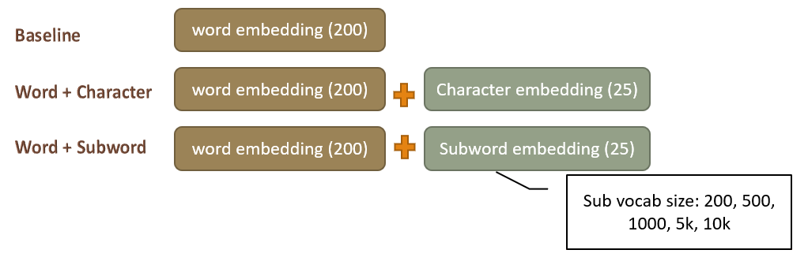
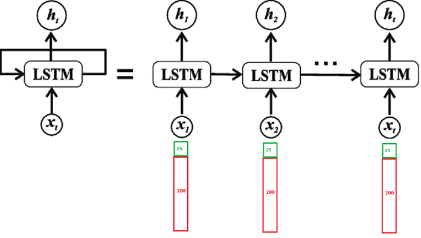

# CE7455-FinalProject-RNNModel

In this project, the RNNModel takes LSTM as framework. The input could be the word embedding with size 200, or word embedding with fragment embedding with size 25.
Here fragment means characters or subwords.

And for a single unit of LSTM, the word embedding and fragment embedding are concatenated together to compose the input.

