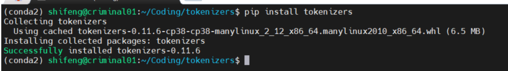
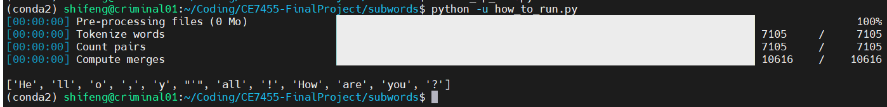

# CE7455-FinalProject Subword Module.

## References

We utilize HuggingFace tokenizer package (more to come!):
  - [HuggingFace](https://github.com/huggingface/tokenizers) (Original implementation) 

## How to install HuggingFace tokenizer package

```bash
pip install tokenizers
```


## How to run how_to_run.py

In the "subwords/" folder:
```python
python -u how_to_run.py
```


## Sample input and output

Given the following input:
```python
output = tokenizer.encode("Hello, y'all! How are you 😁 ?")
print(output.tokens)
```
The output will be:
```
['He', 'll', 'o', ',', 'y', "'", 'all', '!', 'How', 'are', 'you', '?']
```
